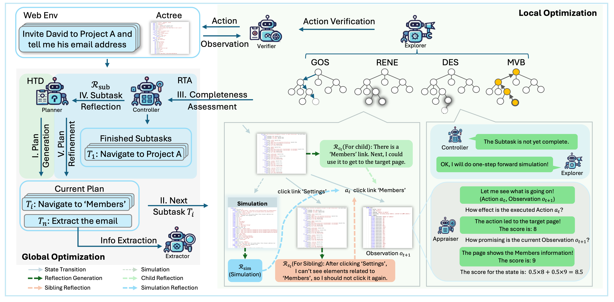

# WebPilot: A Versatile and Autonomous Multi-Agent System for Web Task Execution with Strategic Exploration
<p align="center">
    
    <br>
    <b>WebPilot is a flexible and autonomous multi-agent system that leverages the MCTS algorithm to simulate human cognitive abilities for strategic exploration and efficient web task execution.</b>
</p>

<p align="center">
[<a href="https://yaoz720.github.io/WebPilot/">Website</a>] [<a href="https://arxiv.org/abs/2408.15978">Paper</a>] 
</p>




## Installation
### Install WebPilot
```bash
# Python 3.10+
conda create -n WebPilot python=3.10; conda activate WebPilot
pip install -r requirements.txt
cd WebPilot
pip install -e .
```

### Install WebArena

We have intergrated the necessary WebArena environment code in the WebPilot repository. You can also install the WebArena environment separately.

```bash
cd webarena-main
pip install -r requirements.txt
pip install -e .
```

### Setting WebArena Environment 
Start the docker according to the instructions in the [WebArena repository](https://github.com/web-arena-x/webarena).

Configure urls for the websites
```bash
export SHOPPING="<your_shopping_site_domain>:7770"
export SHOPPING_ADMIN="<your_e_commerce_cms_domain>:7780/admin"
export REDDIT="<your_reddit_domain>:9999"
export GITLAB="<your_gitlab_domain>:8023"
export MAP="<your_map_domain>:3000"
```

## Usage

1. setting OpenAI API key
```bash
export OPENAI_API_KEY="<your_openai_api_key>"
```

2. Run the WebPilot pipeline
```bash
python run_WebPilot.py <task_id you want to run>
```
The WebPilot will now run the task to accomplish the task.
Defaultly the brower will not be visible, but you can set it to be visible by setting the 'headless' parameter to False in the `run_WebPilot.py` file.
A pdf showing the searching tree construction will show up to indicate the current progress.
The results will be shown in the `task_info` folder. Each node in the pdf of searching tree refers to a screenshot of the webpage.

## Successful Trajectories
We show the successful trajectries of WebPilot on the WebArena.
Coming soon.

## Citation
If you find this work useful, please consider citing our paper:
```
@article{zhang2024webpilot,
  title={WebPilot: A Versatile and Autonomous Multi-Agent System for Web Task Execution with Strategic Exploration},
  author={Zhang, Yao and Ma, Zijian and Ma, Yunpu and Han, Zhen and Wu, Yu and Tresp, Volker},
  journal={arXiv preprint arXiv:2408.15978},
  year={2024}
}
```

<!-- ## Acknowledgement -->


